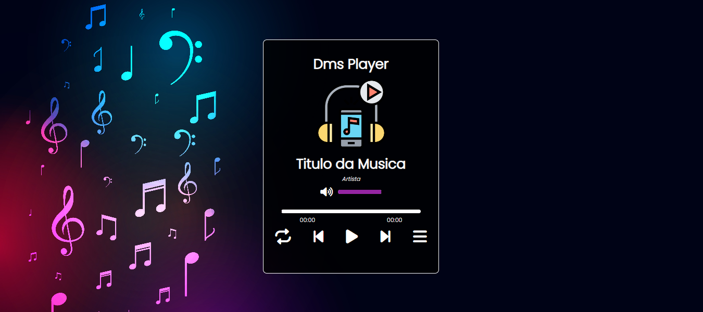

# DMS PLAYER

## Projeto usando Javascript puro

      

## GitPage: https://douglasmonteirodev.github.io/dms-player/

## Informações

### Objetivo desse projeto foi criar um reprodutor de música com grande das partes das funcionalidades de um reprodutor padrão.

## Descrição

- `Há uma playlist onde é listada todas as músicas`
- `Botões next e back`
- `Barra de reprodução, sendo possivel ir para qualquer parte da música`
- `E possui um design responsivo`

# Douglas Monteiro ❤😎

